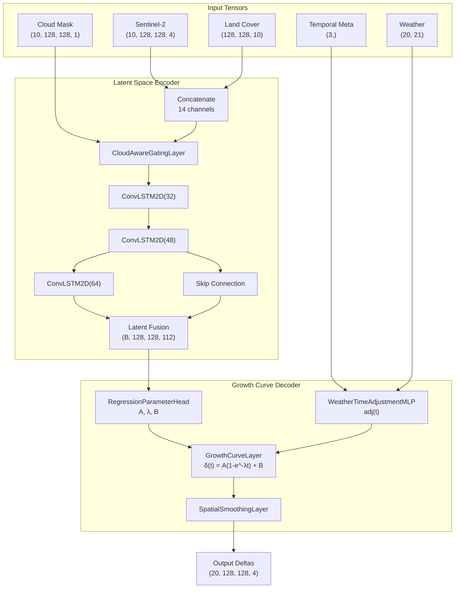

# Satellite NDVI Forecasting with Growth Curve Regression

A deep learning framework for predicting vegetation dynamics using multi-spectral Sentinel-2 imagery, weather data, and a growth curve decoder.

## Overview

This project implements a spatiotemporal encoder-decoder model that forecasts vegetation changes over a 100-day horizon using:
- **Historical Sentinel-2 observations** (10 frames over 50 days)
- **E-OBS climate variables** (7 weather features with climatology-based processing)
- **ESA WorldCover land classification**

The model uses ConvLSTM layers to extract spatiotemporal patterns and predicts reflectance deltas via a saturation growth curve with weather-adjusted rates.

---

## Dataset

### Source: GreenEarthNet
The project uses NetCDF (`.nc`) files containing multi-modal Earth observation data.

### Input Features

| Feature | Shape | Description |
|---------|-------|-------------|
| **Sentinel-2 Bands** | `(10, 128, 128, 4)` | B02 (Blue), B03 (Green), B04 (Red), B8A (NIR) |
| **Cloud Mask** | `(10, 128, 128, 1)` | Binary mask (1 = cloudy/invalid, 0 = clear) |
| **Land Cover** | `(128, 128, 10)` | One-hot encoded ESA WorldCover classes |
| **Temporal Metadata** | `(3,)` | Normalized year, sin(day-of-year), cos(day-of-year) |
| **Weather Features** | `(20, 21)` | E-OBS climate variables (7 vars × 3 aggregations) |

### Target Output

| Component | Shape | Description |
|-----------|-------|-------------|
| **Cloud Mask** | `(20, 128, 128, 1)` | Validity mask for target frames |
| **Reflectance Deltas** | `(20, 128, 128, 4)` | Change from Best Available Pixel (BAP) |
| **BAP Composite** | `(20, 128, 128, 4)` | Reference image for reconstruction |

---

## Data Transformation Pipeline

### 1. Sentinel-2 Preprocessing
```
Raw Observations → NaN Detection → Cloud Masking → Temporal Slicing (every 5 days) → BAP Composite
```
- **Temporal sampling**: Extracts every 5th day from day 4 (input: 10 frames) and day 54 (target: 20 frames)
- **NaN handling**: Missing values are merged into the cloud mask and replaced with zeros
- **BAP composite**: Best Available Pixel method iterates backwards through the sequence to fill cloudy pixels with the most recent clear observation. Applied to both input and target data.

### 2. Temporal Feature Engineering
- **Year normalization**: `(year - 2017) / 4` for 2017–2021 range
- **Cyclic DOY encoding**: Sine and cosine of `2π × day_of_year / days_in_year`

### 3. Weather Feature Processing (E-OBS)

| Variable | Range | Description |
|----------|-------|-------------|
| `eobs_tg` | -20 to 45°C | Mean temperature |
| `eobs_hu` | 0–100% | Relative humidity |
| `eobs_pp` | 950–1050 hPa | Sea level pressure |
| `eobs_qq` | 0–400 W/m² | Global radiation |
| `eobs_rr` | 0–50 mm | Precipitation |
| `eobs_tn` | -30 to 35°C | Minimum temperature |
| `eobs_tx` | -10 to 50°C | Maximum temperature |

**Climatology-based detrending**:
1. Compute 21-day rolling mean (climatology)
2. Calculate anomalies: `value - climatology`
3. For each 5-day forecast step, extract:
   - `min_detrend`: Minimum anomaly (normalized to [-1, 1])
   - `max_detrend`: Maximum anomaly (normalized to [-1, 1])
   - `mean_clima`: Mean climatology (normalized to [0, 1])

---

## Model Architecture

The model uses a **Growth Curve Regression** architecture that predicts reflectance deltas via interpretable saturation growth parameters.

### High-Level Architecture



### Regression Parameter Head

Generates triplet parameters **(A, λ, B)** per pixel per band:

| Parameter | Activation | Description |
|-----------|------------|-------------|
| **A** (amplitude) | `tanh × scale` | Bounded, can be ± |
| **λ** (rate) | `sigmoid → [λ_min, λ_max]` | Growth rate > 0 |
| **B** (offset) | `tanh × 0.1` | Baseline [-0.1, 0.1] |

### Growth Curve Formula

```math
δ(t) = A · (1 - exp(-λ · T · t · adj(t))) + B
```

- `t ∈ [0, 1]` — normalized time
- `T = 20` — output timesteps  
- `adj(t) ∈ [0.5, 1.5]` — weather/time adjustment

---

## Loss Function: ImprovedkNDVILoss

The `ImprovedkNDVILoss` combines regression accuracy with variance preservation and spectral consistency.

### Components

All components are normalized to similar scales (~0.01-0.1) before weighting:

| Component | Default Weight | Description |
|-----------|----------------|-------------|
| **Regression** | 10.0 | Primary objective (Huber δ=0.1) |
| **Variance Penalty** | 1.0 | Regularizer to prevent mode collapse |
| **kNDVI** | 0.0 → 1.0 | Auxiliary loss (enabled via callback) |

1. **Masked Huber Loss** (on reflectance deltas):
   ```python
   L_reg = HuberLoss(δ=0.1)(true_deltas, pred_deltas) × (1 - cloudmask)
   ```

2. **Variance Penalty** (prevents constant predictions):
   ```python
   var_true = spatial_variance(true_deltas)
   var_pred = spatial_variance(pred_deltas)
   L_var = |var_true - var_pred| × 100  # scaled to match regression range
   ```

3. **kNDVI Loss** (kernel NDVI using RBF):
   ```python
   k(n, r) = exp(-(n - r)² / 2σ²)
   kNDVI = (1 - k) / (1 + k)
   L_kndvi = min(|kNDVI_true - kNDVI_pred|, 0.5) × 0.1  # clipped and scaled
   ```

### Combined Loss
```python
L_total = w_reg × L_reg + w_var × L_var + w_kndvi × L_kndvi
```

### EnablekNDVICallback
The kNDVI component is disabled during initial training (warmup) and enabled after a specified epoch via `EnablekNDVICallback`:

```python
EnablekNDVICallback(enable_epoch=20, kndvi_weight=1.0)
```

### Reconstruction
Full reflectance is reconstructed as `BAP + deltas`, allowing kNDVI computation on absolute values while training on relative changes.

---

## Project Structure

```
bspline_ndvi/
├── src/
│   ├── build_model.py   # Model architecture & ParametricEvalLayer
│   ├── dataset.py       # DatasetGenerator with weather processing
│   ├── losses.py        # MaskedHuberLoss & kNDVILoss
│   ├── train.py         # Training pipeline with CLI
│   ├── config.py        # Dataset paths
│   └── visualize.py     # Visualization utilities
├── checkpoints/         # Saved model weights
├── logs/                # TensorBoard logs
└── tests/               # Unit tests
```

---

## Usage

### Training
```bash
python src/train.py \
    --train_dir /path/to/train/data \
    --val_dir /path/to/val/data \
    --epochs 500 \
    --batch_size 2 \
    --learning_rate 1e-3
```

### Resume from Checkpoint
```bash
python src/train.py \
    --resume_from checkpoints/model_at_100.keras \
    --initial_epoch 100
```

### Key Arguments
| Argument | Default | Description |
|----------|---------|-------------|
| `--train_dir` | config path | Training data directory |
| `--val_dir` | config path | Validation data directory |
| `--epochs` | 500 | Total training epochs |
| `--batch_size` | 1 | Batch size |
| `--learning_rate` | 1e-3 | Initial learning rate |
| `--checkpoint_dir` | `checkpoints/` | Model save directory |

---

## Requirements

- Python 3.9+
- TensorFlow/Keras 2.x
- NumPy
- xarray
- pandas
- glob
